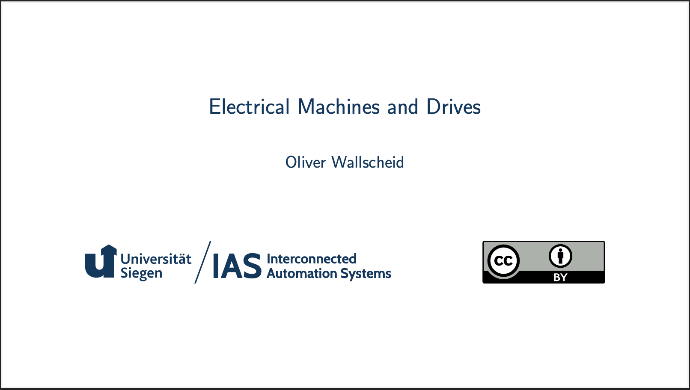

# Fundamentals of electrical machines and drives course

[](https://github.com/IAS-Uni-Siegen/EMD_Course/actions/workflows/BuildPDFs.yml)
[![CC BY 4.0][cc-by-shield]][cc-by]
[](https://www.python.org/)
[](https://www.latex-project.org/)
[](https://doi.org/10.5281/zenodo.17440807)


This work is licensed under a
[Creative Commons Attribution-ShareAlike 4.0 International License][cc-by].

[![CC BY 4.0][cc-by-image]][cc-by]

[cc-by]: http://creativecommons.org/licenses/by/4.0/
[cc-by-image]: https://licensebuttons.net/l/by/4.0/88x31.png
[cc-by-shield]: https://img.shields.io/badge/License-CC%20BY%204.0-lightgrey.svg

## Lecture slides (click on preview picture)
<a href="https://ias-uni-siegen.github.io/EMD_course/lecture.pdf" target="_blank" class="image fit"></a>

The covered topics are:
- [An initial overview of electrical machines and drives](https://ias-uni-siegen.github.io/EMD_course/lecture.pdf#sec1) 
- [Fundamental electromagnetic principles and magnetic materials](https://ias-uni-siegen.github.io/EMD_course/lecture.pdf#sec2) 
- [DC machines](https://ias-uni-siegen.github.io/EMD_course/lecture.pdf#sec3) 
- [Transformers](https://ias-uni-siegen.github.io/EMD_course/lecture.pdf#sec4) 
- [Rotating field theory](https://ias-uni-siegen.github.io/EMD_course/lecture.pdf#sec5) 
- [Induction machines](https://ias-uni-siegen.github.io/EMD_course/lecture.pdf#sec6) 
- [Synchronous machines](https://ias-uni-siegen.github.io/EMD_course/lecture.pdf#sec7) 

## Exercise tasks (click on preview picture)
<a href="https://ias-uni-siegen.github.io/EMD_course/exercise.pdf" target="_blank" class="image fit"></a>

## Exercise tasks including solutions (click on preview picture)
<a href="https://ias-uni-siegen.github.io/EMD_course/exercise_with_solution.pdf" target="_blank" class="image fit"></a>

## Exam history

| Exam       | Only tasks                                  | Tasks with solutions                            |
|------------|---------------------------------------------|-------------------------------------------------|
| Summer 2025       | [Only tasks](https://ias-uni-siegen.github.io/EMD_course/summer2025.pdf)   | [Tasks with solutions](https://ias-uni-siegen.github.io/EMD_course/summer2025_with_solution.pdf)
| Winter 2024       | [Only tasks](https://ias-uni-siegen.github.io/EMD_course/winter2024.pdf)   | [Tasks with solutions](https://ias-uni-siegen.github.io/EMD_course/winter2024_with_solution.pdf) |
| Summer 2024       | [Only tasks](https://ias-uni-siegen.github.io/EMD_course/summer2024.pdf)   | [Tasks with solutions](https://ias-uni-siegen.github.io/EMD_course/summer2024_with_solution.pdf) |
| Summer 2024 (mock-up)| [Only tasks](https://ias-uni-siegen.github.io/EMD_course/summer2024_mock-up.pdf)   | [Tasks with solutions](https://ias-uni-siegen.github.io/EMD_course/summer2024_mock-up_with_solution.pdf) |


## Citation
See "Cite this repository" info box on the top-right or use the following BibTeX entry for citing it:
```
@misc{Wallscheid_Fundamentals_of_electrical_2024,
    author = {Wallscheid, Oliver and Hölsch, Lukas},
    doi = {10.5281/zenodo.14215440},
    title = {{Fundamentals of electrical machines and drives}},
    url = {https://github.com/IAS-Uni-Siegen/EMD_course},
    year = {2024}
}
```

### Contributing

- We recommend using [VSCode](https://code.visualstudio.com/) as code editor.
- [Ruff](https://github.com/astral-sh/ruff) should be installed.

    ```python
    pip install ruff
    ```
- It is expected that [LaTeX Workshop](https://marketplace.visualstudio.com/items?itemName=James-Yu.latex-workshop) extension and [Ruff](https://marketplace.visualstudio.com/items?itemName=charliermarsh.ruff) extension is installed so that formatting of the code is achieved automatically.
